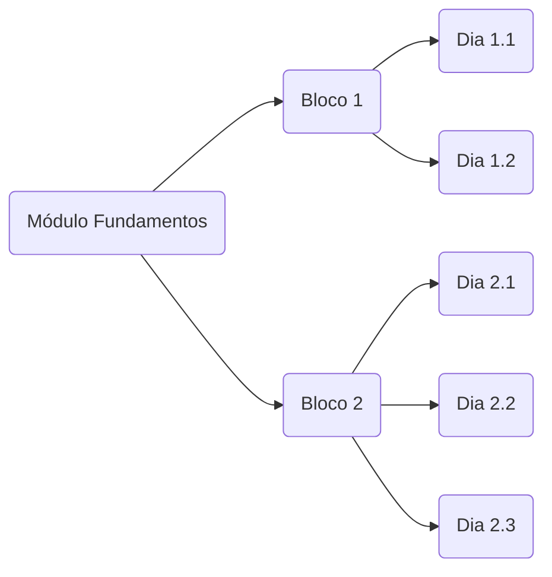

# Exercícios - Trybe

Olá! Esse é o repositório com todos os **exercícios resolvidos** durante o curso de **desenvolvimento web** da **[Trybe](https://www.betrybe.com/)**. Todos os exercícios seguiram as diretrizes indicadas pela plataforma do curso e foram realizados por **[Erik Yamamoto](https://www.linkedin.com/in/erikyamamoto/)**.

## Organização

Os exercícios são organizados conforme os módulos, blocos e dias do curso. No total são 4 grandes módulos (**Fundamentos, Front-end, Back-end e Ciências da Computação**) subdivididos por blocos. Esses blocos, por sua vez, são subdivididos em dias, como mostra o diagrama exemplo de um módulo:

A seguir os 4 módulos e suas respectivas listas de blocos.

## 1. Fundamentos
 - [x] Unix e Shell
 - [x] Introdução à HTML e CSS
 - [x] Introdução à JavaScript e Lógica de Programação
 - [x] DOM e Web Storage
 - [x] HTML e CSS - Forms e Flexbox Responsivo
 - [x] JavaScript ES6 e Testes Unitários
 - [x] Higher Order Functions

## 2. Front-end
 - [x] JavaScript e Testes Assíncronos - Jest
 - [x] Introdução à React
 - [x] React: Componentes com Estados, Eventos e Forms
 - [x] Ciclo de Vida de Componentes e React Router
 - [x] Metodologias Ágeis
 - [x] RTL 
 - [x] Redux + React
 - [x] Context API e React Hooks

## 3. Back-end
 - [x] Docker: Utilizando containers
 - [x] Introdução à SQL
 - [x] Funções SQL, JOINs e Normalização
 - [x] Introdução ao Desenvolvimento Web com Node.js
 - [x] Arquitetura de Software: Model, Service e Controller (MSC)
 - [x] Node.js: ORM e Autenticação
 - [x] Deployment
 - [ ] Typescript
 - [ ] Programação Orientada a Objetos e SOLID
 - [ ] Introdução ao Mongo DB
 - [ ] MongoDB com Node.js e POO

## 4. Ciências da Computação
 - [ ] Introdução à Python
 - [ ] Padrões de Projeto
 - [ ] Redes e Raspagem de Dados
 - [ ] Algoritimos
 - [ ] Estrutura de Dados I: Arrays, Hashmaps e Sets
 - [ ] Estrutura de Dados II: Listas, Filas e Pilhas
